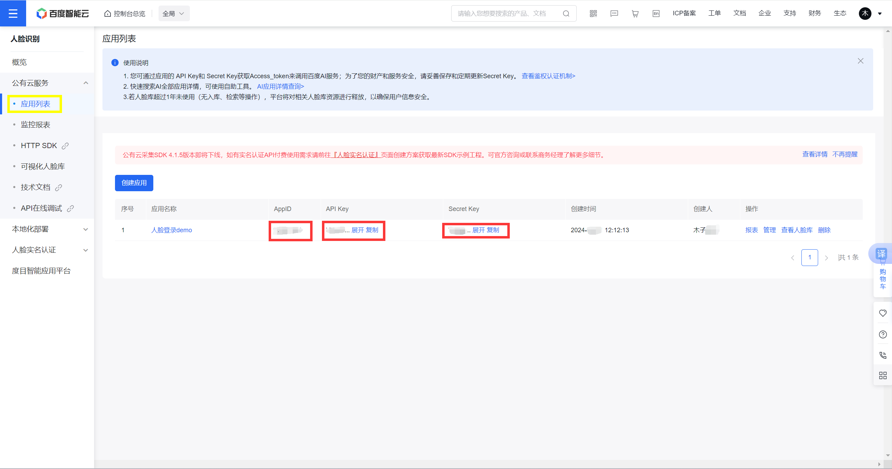
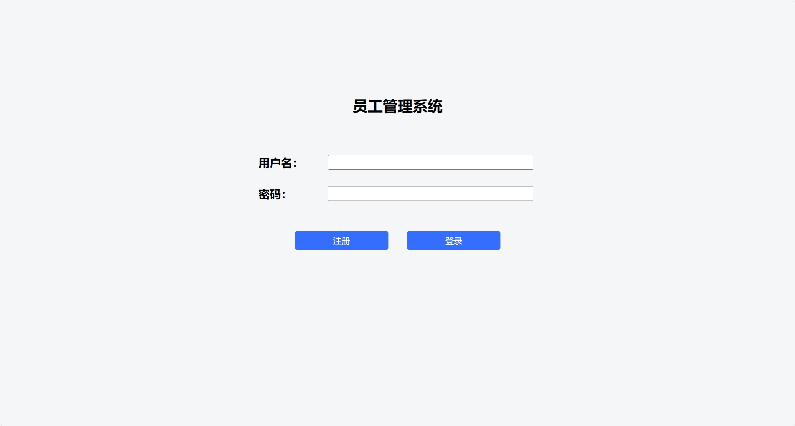
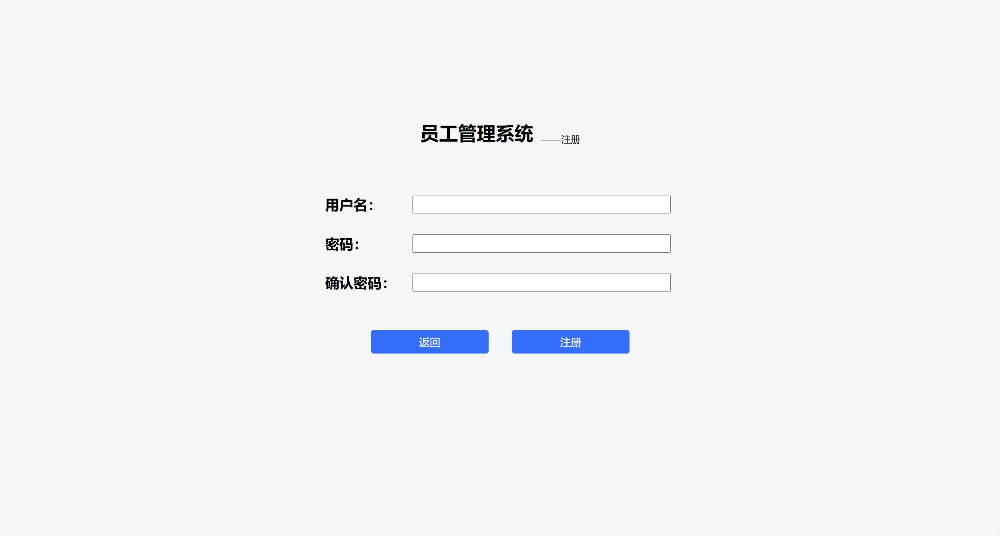
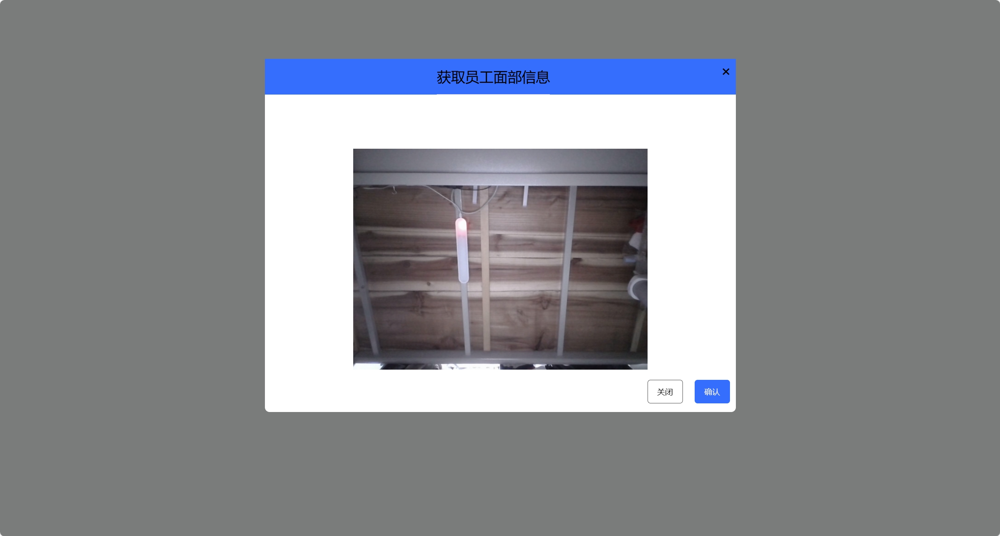
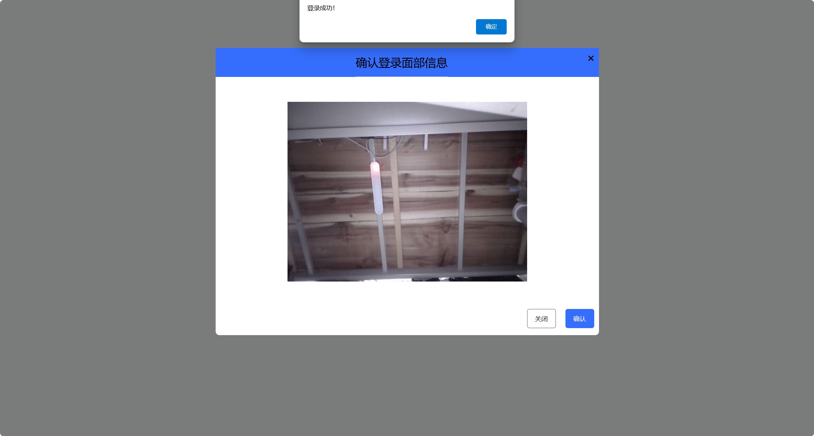
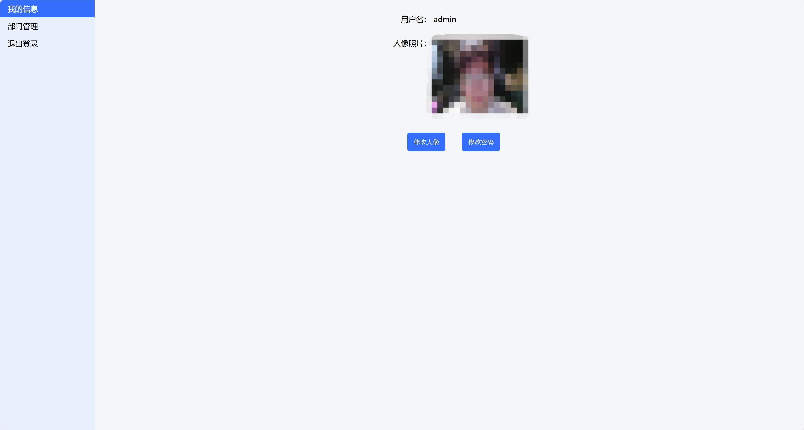
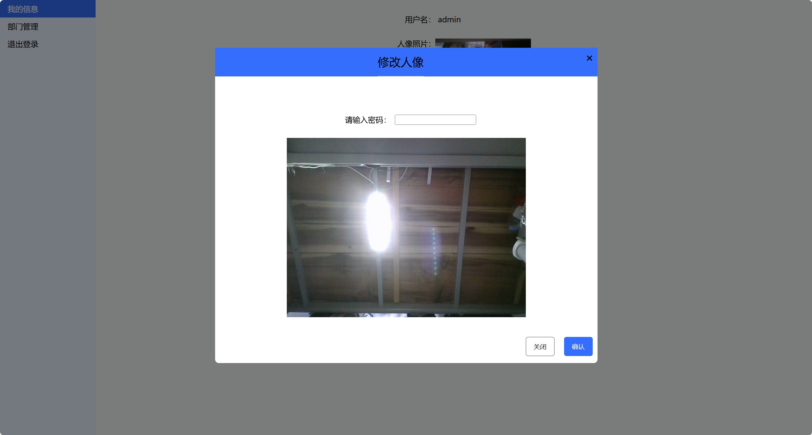
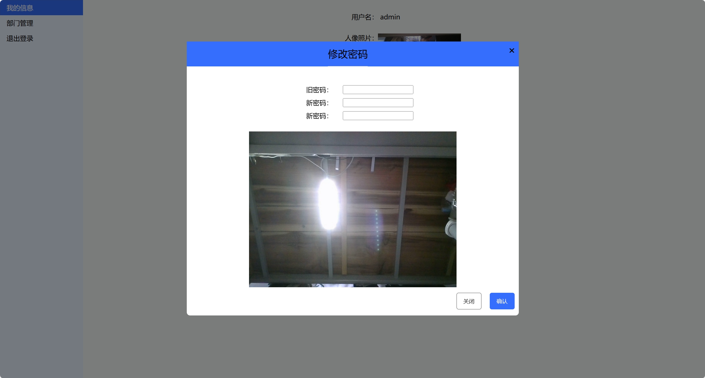

# 集成百度AI人脸识别的登录demo
> 基于百度人脸识别V3.0，现升级到V3.0，并增加其他功能
## 百度AI
 参考：https://ai.baidu.com/ai-doc/FACE/8k37c1rqz#%E5%BF%AB%E9%80%9F%E5%85%A5%E9%97%A8
 注意在properties文件中填写这三个密钥
 
 > 由于人脸认证API需付费才能开通，所以用人脸对比（获取储存在服务器的人脸图片和现场拍摄的人脸图片的相似度）实现类似的功能。
## 功能
主要功能包括注册、登录、修改密码、修改人像
### 首页

### 注册

### 登陆成功

### 信息页

### 修改人像

### 修改密码
